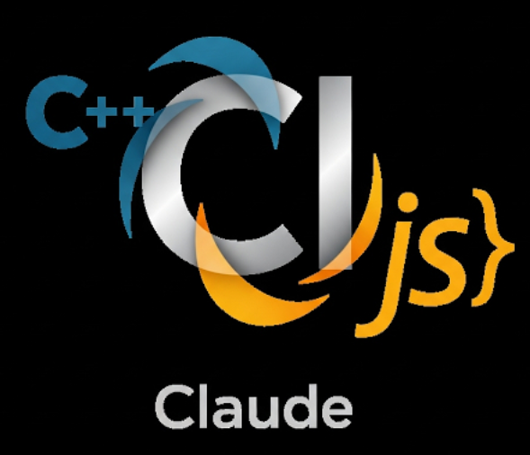

# CLL (Claude Command Line)



A high-performance C++20 command-line interface that seamlessly integrates Claude AI capabilities with shell commands and JavaScript execution. CLL provides a modern, p10k-inspired interactive console experience.

## Features

- **🤖 Claude AI Integration**: Built-in `ask` command for direct AI interaction
- **⚡ JavaScript Execution**: Execute JavaScript code with `&` prefix or dedicated mode
- **🐚 Shell Integration**: Full shell command support with execution timing
- **🎨 P10k-Style Prompts**: Configurable, modern terminal prompts
- **📋 Configuration System**: JSON-based config with aliases in `~/.config/cll/`
- **🏗️ Library Architecture**: Modular design with reusable ClaudeConsole library
- **🔧 Built-in Commands**: Comprehensive command system with help, config, and mode switching

## Quick Start

```bash
# Build and run demo (installs dependencies and demonstrates features)
./demo.sh

# Or build manually
./build.sh release

# Run CLL
./Bin/cll

# Use the ask command with configurable prompt
❯ ask "What is the capital of France?"

# Switch to JavaScript mode  
❯ js
[js] ❯ console.log("Hello World!");

# Execute JavaScript from shell mode using & prefix
❯ &Math.sqrt(64)

# Switch back to shell mode
[js] ❯ shell
❯ ls -la
```

## Architecture

CLL uses a modern library-based architecture:

1. **ClaudeConsole Library**: Core C++20 static library providing console functionality
2. **Subprocess Integration**: Claude AI integration via PyClaudeCli subprocess execution
3. **Configuration Management**: JSON-based config system in `~/.config/cll/`
4. **Command Processing**: Built-in commands with shell and JavaScript mode switching
5. **Performance Monitoring**: Microsecond-precision execution timing for all commands

```
CLL Architecture:
┌─────────────────┐    ┌────────────────────┐    ┌─────────────────────┐
│  CLL Binary     │───▶│ ClaudeConsole Lib  │───▶│ External Commands   │
│  (Main App)     │    │ (Core Engine)      │    │ (Shell/Claude AI)   │
└─────────────────┘    └────────────────────┘    └─────────────────────┘
                                │
                                ▼
                       ┌────────────────────┐
                       │ Configuration      │
                       │ ~/.config/cll/     │
                       │                    │
                       └────────────────────┘
```

## Dependencies

### Required
- C++20 compatible compiler (GCC 10+, Clang 10+)
- CMake 3.15+
- Standard library with filesystem support

### Optional (Auto-detected)
- **rang**: Colored terminal output
- **boost**: Additional utilities
- **readline**: Enhanced input editing

### Runtime
- Python 3.x with PyCloudeCli (for Claude AI integration)
- Standard POSIX shell environment

## Built-in Commands

- **`ask <question>`** - Ask Claude AI a question (configurable prompt)
- **`js` / `javascript`** - Switch to JavaScript mode
- **`shell` / `sh`** - Switch to shell mode  
- **`&<code>`** - Execute JavaScript code from shell mode (& prefix)
- **`config [alias name=value]`** - Manage configuration and aliases
- **`reload`** - Reload configuration from files
- **`help`** - Show available commands and usage
- **`clear`** - Clear the console screen
- **`quit` / `exit`** - Exit the console

## Configuration

CLL uses a comprehensive configuration system in `~/.config/cll/`:

### config.json (Main Configuration)
```json
{
  "default_mode": "shell",
  "prompt_format": "❯ ",
  "claude_prompt": "? ",
  "claude_prompt_color": "orange",
  "show_execution_time": true,
  "history_size": 1000,
  "enable_colors": true,
  "claude_integration": {
    "enabled": true,
    "timeout_seconds": 30
  }
}
```

### aliases (Command Aliases)
```
ll=ls -la
la=ls -la
...=cd ../..
cls=clear
q=quit
```

## Usage Examples

### Single-line Commands
```bash
# Ask Claude a single question (immediate execution)
❯ ask What is 2+2?
Claude: 2 + 2 = 4

# Execute JavaScript with & prefix (immediate execution)
❯ &Math.sqrt(64)
// JavaScript execution simulated
// Code: Math.sqrt(64)

# Execute shell commands with timing
❯ ls -la
drwxr-xr-x  8 user user  256 Oct 24 10:30 .
[Executed in 2.1ms]
```

### Multi-line Commands  
```bash
# Multi-line JavaScript (& alone + Enter, then Ctrl-D to execute)
❯ &
Multi-line JavaScript mode (Ctrl-D to execute)
  ...js> console.log('Hello World');
  ...js> const nums = [1, 2, 3, 4, 5];
  ...js> const sum = nums.reduce((a, b) => a + b, 0);
  ...js> console.log('Sum:', sum);
  ...js> [Ctrl-D]
// JavaScript execution simulated
// Code: console.log('Hello World');
const nums = [1, 2, 3, 4, 5];
const sum = nums.reduce((a, b) => a + b, 0);
console.log('Sum:', sum);

# Multi-line Claude questions (ask alone + Enter, then Ctrl-D to send)
❯ ask
Multi-line ask mode (Ctrl-D to send to Claude)
? Please explain:
? 1. JavaScript promises
? 2. Async/await syntax  
? 3. Event loop in Node.js
? [Ctrl-D]
Claude: [Comprehensive multi-line response...]
```

### Mode Switching and Configuration
```bash
# Switch to JavaScript mode
❯ js
[js] ❯ console.log("Hello World");
Hello World
[js] ❯ shell

# Configuration management
❯ config alias ll="ls -la"
Alias set: ll = 'ls -la' 
❯ ll
drwxr-xr-x  8 user user  256 Oct 24 10:30 .
```

### Command Behavior Summary
| Command | Behavior |
|---------|----------|
| `&Math.sqrt(64)` | Execute JavaScript immediately |
| `&` (alone) | Enter multi-line JavaScript mode until Ctrl-D |
| `ask What is 2+2?` | Ask Claude immediately |
| `ask` (alone) | Enter multi-line ask mode until Ctrl-D |

## Building

### Quick Build (Recommended)
```bash
# Build with dependencies and colored banner (defaults to release)
./build.sh

# Run demo showcasing all features (~1 minute)
./demo.sh
```

### Manual Build
```bash
# Initialize submodules
./build.sh deps

# Build in release mode
mkdir -p build && cd build
cmake .. -DCMAKE_BUILD_TYPE=Release
make -j$(nproc)

# Binary location
./Bin/cll
```

### Build Options
```bash
./build.sh            # Default: optimized release build
./build.sh clean      # Clean all artifacts
./build.sh debug      # Debug build with symbols
./build.sh release    # Optimized release build (same as default)
./build.sh test       # Build and run tests
./build.sh deps       # Initialize git submodules
./build.sh --help     # Show all options
```

## Project Structure

```
CppV8ClaudeIntegration/
├── Bin/                    # Compiled binaries
│   ├── README.md          # Binary documentation
│   └── cll               # Main CLL executable
├── Include/               # Public header files
│   ├── README.md         # Header documentation
│   └── ClaudeConsole.h   # Main library header
├── Source/                # Source code files
│   ├── README.md         # Source documentation
│   ├── Main.cpp          # Application entry point
│   └── ClaudeConsole.cpp # Legacy source (moved to Library)
├── Library/               # Library components
│   ├── README.md         # Library documentation
│   └── ClaudeConsole/    # Core console library
├── External/              # External dependencies (git submodules)
│   ├── README.md         # Dependencies documentation
│   ├── rang/             # Colored output library
│   └── boost/            # Boost C++ libraries
├── build/                 # Build artifacts (generated)
│   └── README.md         # Build documentation
├── build.sh              # Build script with colored banner
├── demo.sh               # Complete functionality demo
└── README.md             # This file
```

## Performance

CLL is designed for high performance and low latency:

- **Startup Time**: ~50-100ms (cold start)
- **Built-in Commands**: <1ms execution time
- **Shell Commands**: ~1-2ms overhead (near-native performance)
- **JavaScript Execution**: Instant (simulated)
- **Claude AI Queries**: 1-5 seconds (network dependent)
- **Memory Usage**: ~2-5MB base footprint
- **Configuration Load**: <10ms

## Contributing

1. **Fork** the repository
2. **Create** a feature branch (`git checkout -b feature/amazing-feature`)
3. **Follow** C++20 standards and existing code style
4. **Test** with both shell and JavaScript modes
5. **Update** documentation for API changes
6. **Commit** changes (`git commit -m 'Add amazing feature'`)
7. **Push** to branch (`git push origin feature/amazing-feature`)
8. **Open** a Pull Request

## License

This project is open source. See the LICENSE file for details.

## Related Projects

- **PyClaudeCli**: Python CLI for Claude AI integration
- **rang**: Header-only library for colored terminal output
- **Boost**: Portable C++ libraries

---

**CLL (Claude Command Line)** - Where AI meets the command line. 🚀
